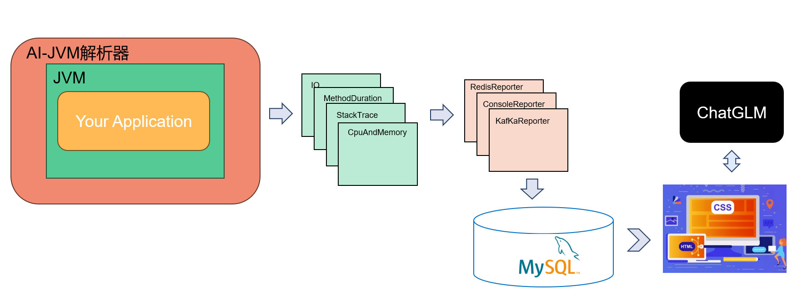

# 🌈 什么是AI-JVM-Profiler？
一款对应用程序无侵害的JVM内存解析系统，

# 📚 妙用AI-JVM-Profiler
## 多种解析器，挑选一下吧
### 🚀 CpuAndMemory解析器
CpuAndMenory负责解析程序运行过程中CPU、堆内堆外内存和GC的各种情况，收集指标如下：

**1. 基本指标**

| Title      | metricValue |Note| Options
| ----------- | ----------- |----------- |----------- |
| appId      | null       |程序的唯一标识| |
| name   | *        | 应用程序的名称| |
|processUuid|a0b98ea4-0995-451e-ba89-8ee40c563eef|进程标识
|tag|mytag|标签
|heapMemoryMax|2109734912|堆内存的最大值
|nonHeapMemoryMax|-1|非堆内存的最大值
|nonHeapMemoryTotalUsed|14656800|当前非堆内存的已使用量
|nonHeapMemoryCommitted|18350080|非堆内存的已提交量
|heapMemoryCommitted|132120576|堆内存的已提交量
|heapMemoryTotalUsed|15865344|堆内存的已使用量
|systemCpuLoad|0.00305371|系统CPU负载率
|processCpuLoad|0.00052097|进程CPU负载率
|processCpuTime|437500000| | 纳秒
|epochMillis|1722683736110|数据采集的时间|毫秒，自1979.01.01 00：00：00
**2. GC解析**

|title|metricValue|Note|Options
| ----------- | ----------- |----------- |----------- |
|name|G1 Young Generation|垃圾回收器的名称|"G1 Young Generation"、"G1 Old Generation"、"PS MarkSweep" 
|collectionCount|2|垃圾回收次数|累加
|collectionTime|1000|总回收时间（Mills）|累加

**3. 内存解析，支持解析堆内内存（Eden、Old、Survivor）和堆外内存**

|title|metricValue|Note|Options
| ----------- | ----------- |----------- |----------- |
|name|G1 Eden Space|内存池名称|Eden、Survivor..
|type|Heap memory|堆类型|堆、非堆
|usageCommitted|35651584|向操作系统申请资源|-
|usageMax|-1|最大容量|-
|usageUsed|-1|已使用容量|-
|peakUsageCommitted|24117248|峰值向操作系统申请资源|-
|peakUsageMax|35651584|峰值最大已使用|-
|peakUsageUsed|24117248|峰值已使用|-

**4. JVM缓冲池**

|title|metricValue|Note|Options
| ----------- | ----------- |----------- |----------- |
|totalCapacity|0|缓冲区总容量
|name|mapped|缓冲区类型|dirct、map
|count|0|缓冲区数量
|memoryUsed|0|已使用内存
### 🚀 Method可持续时间分析解析器

|title|metricValue|Note|Options
| ----------- | ----------- |----------- |----------- |
|metricName|duration.max||max,min,sum,count|
|className|UserserviceImpl|所监控的类名|
|methodName|getUser|监控的方法|
|metricValue|2814|运行时间|
|epochMillis|1722749944630|检测时间

### 🚀 StackTrace栈追踪解析器

栈追踪解析器使用JMX收集JVM运行过程中的线程信息，通过封装的threadInfo来收集栈使用信息，不限但包括main、Attach Listener、Signal Dispatcher
|title|metricValue|Note|Options
| ----------- | ----------- |----------- |----------- |
| threadName | main |
| stacktrace | list | 栈追踪链路显示 | list|
| threadState | RUNNABLE | 线程状态 | 就绪、执行、阻塞、停止|
| startEpoch | 1722749894625 | 开始收集时间
| endEpoch | 1722749899630 | 收集结束时间

### 🚀 IO解析器

IO解析器主要监控Linux系统中的`/proc/self/io`文件，收集当前程序运行过程中的IO指标，如下

|title|metricValue|Note|Options
| ----------- | ----------- |----------- |----------- |
| rchar |  | 读字符数 | - |
| wchar |  | 写字符数 | - |
| read_bytes |  | 读字节数 | - |
| write_bytes |  | 写字节数 | - |

### 🚀 JVM线程解析器
 JVM线程解析器，监控程序执行过程中总线程数、峰值线程数、实时/活动线程数和新线程数。

|title|metricValue|Note|Options
| ----------- | ----------- |----------- |----------- |
| totalStartedThreadCount |  | 总线程数 | - |
| newThreadCount |  | 新线程数 | - |
| liveThreadCount |  | 活跃线程数 | - |
| peakThreadCount |  | 峰值线程数 | - |

## 智能JVM调优建议
对于新手，可能当程序不停的出现各种GC、CPU|内存飙升的现象而手足无措，
我们引入智谱大模型通过**微调技术实现对JVM调优的建议以及你当前程序可能存在的问题。
### 我应该怎么引入智能化？
1. 修改application.yml的ai.apikey为你自己的
2. 

📕
🔬 🚀 
## 🤗 email
如果你有任何问题，请尽管联系我 xingtang@csu.edu.cn
